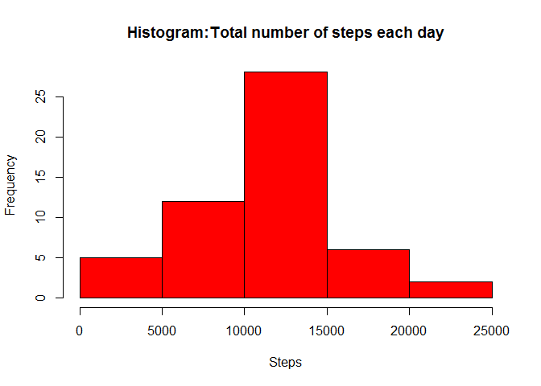
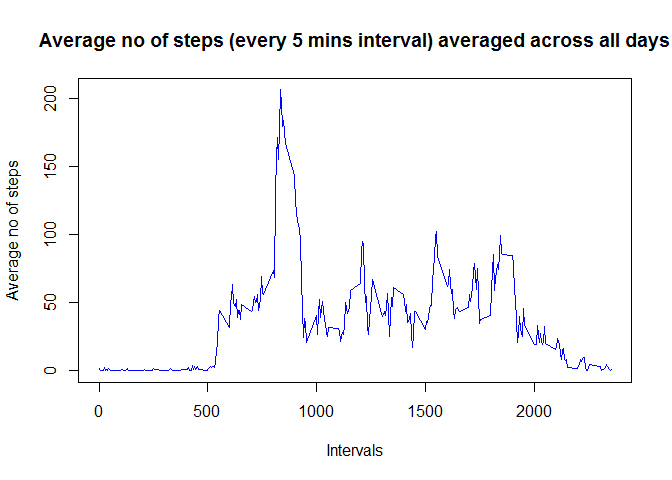
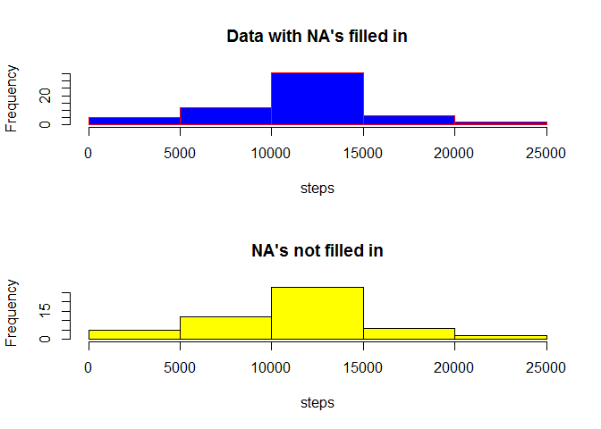
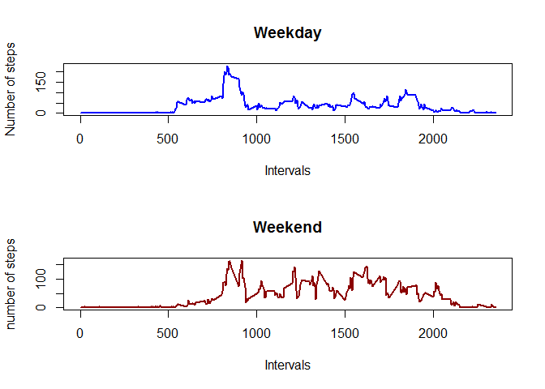

# Reproducible Research: Peer Assessment 1


## Loading and preprocessing the data
Here we unzip the data which we are going to use in our analysis, as well as taking a look at the data's attributes as well as variables

```r
unzip("activity.zip")
```

```r
data<-read.csv("activity.csv",sep=',',header=TRUE)
```
Extract the variables names

```r
names(data)
```

```
## [1] "steps"    "date"     "interval"
```
Extract the dimension of the data, just in case (since the data we are dealing with here is small, this step may not be necessary. However when dealing with large data set, it is good to know the size of the data we are dealing with so we can determine if our computer has sufficient memory to process the data)

```r
dim(data)
```

```
## [1] 17568     3
```
Extract the first six rows of the data

```r
head(data)
```

```
##   steps       date interval
## 1    NA 2012-10-01        0
## 2    NA 2012-10-01        5
## 3    NA 2012-10-01       10
## 4    NA 2012-10-01       15
## 5    NA 2012-10-01       20
## 6    NA 2012-10-01       25
```
Similarly, extract the last six rows of the data

```r
tail(data)
```

```
##       steps       date interval
## 17563    NA 2012-11-30     2330
## 17564    NA 2012-11-30     2335
## 17565    NA 2012-11-30     2340
## 17566    NA 2012-11-30     2345
## 17567    NA 2012-11-30     2350
## 17568    NA 2012-11-30     2355
```
The data is presented in 5 minutes interval, wheras in the analysis below we are dealing in the unit of day, so some adjustment to the data can be done to make our task easier.

```r
library(dplyr) #install and load this library to add hour and minute to the dataset
```
We then use the mutate() function under dplyr library to add the hour and minute into our data

```r
data<-mutate(data,hour=interval %/% 100, minute = interval %%100)
```
## What is mean total number of steps taken per day?
Missing values are ignored for this section.
To calculate the total number of steps taken per day,

```r
dailysteps<-c()
for (i in 1:61){#October has 31 days, November has 30, so total days is 61
    begin<-(i-1)*288+1#1 day has 24 hours each hour has 12 5-min interval, 24*12=288
    last<-(i-1)*288+288
    temp<-data[begin:last,1]#extracting all 5-mins interval steps
    dailysteps<-c(dailysteps,sum(temp))
}
```
To make the histogram for total number of steps taken every day. In the histogram plot below, frequency refers to the number of days a certain number of steps is achieved.

```r
dailystepsvalid<-dailysteps[!is.na(dailysteps)] #NA entry is not used in this part

hist(dailystepsvalid,xlab="Steps", ylab="Frequency", col="red",border="black",main="Histogram:Total number of steps each day")
```

 

Now to compute the mean and the median of the distribution data above,
Firstly, the mean:

```r
mean(dailysteps,na.rm=T)
```

```
## [1] 10766.19
```
subsequently, the median:

```r
median(dailysteps,na.rm=T)
```

```
## [1] 10765
```

## What is the average daily activity pattern?

To make the time series plot of 5-min intervals (x-axis)and the average steps taken, averaged across all days (y-axis)

```r
x<-data[,1]#return the number of steps in all 5-min interval
y<-matrix(x,288,61)#create a matrix of 288 rows and 61 columns. 288 for the no of 5-mins interval each day, and 61 for the total no of days in the time period of October-November
steps_average<-apply(y,1,mean,na.rm=TRUE) #averaging across all days

plot(data$interval[1:288],steps_average, type='l', col='blue', xlab='Intervals',ylab='Average no of steps',main='Average no of steps (every 5 mins interval) averaged across all days')
```

 


To determine the 5-min interval with the max no of steps (across all the days in the dataset):

```r
hour<-data$hour[1:288]
min<-data$minute[1:288]

maxhour<-hour[which(steps_average==max(steps_average))]
maxmin<- min[which(steps_average==max(steps_average))]

cat('Max no of steps is at',maxhour,':',maxmin)
```

```
## Max no of steps is at 8 : 35
```
## Imputing missing values

To compute the total number of missing values:

```r
sum(is.na(data[,1]))
```

```
## [1] 2304
```
To fill in the missing values using the pre-calculated mean of the 5-min interval:

```r
steps_average_filled<-rep(steps_average,61)
data2<-data #to avoid messing up the original data, we create a copy

for(i in 1:length(data2[,1])){
    if(is.na(data2[i,1])==TRUE)
        data2[i,1]=steps_average_filled[i]
    }
```
Create a new dataset which is identical to the original dataset, only with the missing values filled with the mean: the dataset data2 in the code above fulfilled this criteria

To make a histogram of the total number of steps taken each day and Calculate and report the mean and median total number of steps taken per day. 


```r
# Calculate the total number of steps taken per day using the data with filled NA's. Similar with the previous one we do with all the NAs factored in, the difference is that we use the modified dataset data2, instead of the original dataset,data.

daily1<-c()


for (i in 1:61){           
    start<-(i-1)*288+1        
    last<-(i-1)*288+288
    temp<-data2[start:last,1]    
    daily1<-c(daily1,sum(temp))   
}
```

To compare the histograms between using the mean-filled data and the original data(with missing values), we plot a similar histogram to the one we did earlier. 2 Histogram will be plotted, one for the original dataset and the other for the modified dataset


```r
par(mfrow=c(2,1))

hist(daily1, xlab="steps",ylab="Frequency",
     main="Data with NA's filled in",border='red',col="blue")

hist(dailystepsvalid, xlab="steps",ylab="Frequency",
     main="NA's not filled in",border='black',col="yellow")
```

 
With the modified dataset, the new mean of the total no of steps taken daily is:

```r
mean(daily1)
```

```
## [1] 10766.19
```
And the median is:

```r
median(daily1)
```

```
## [1] 10766.19
```
Do these values differ from the estimates from the first part of the assignment? What is the impact of imputing missing data on the estimates of the total daily number of steps?

```
From the histogram we can clearly see that after filling in all the missing values (here we use the mean value as the filler) the median has changed, as well as the data spread. Depending on the method used to fill in the NAs entries, the new mean and median, as well as the shape of the histogram may differ.
```
## Are there differences in activity patterns between weekdays and weekends?

To answer this we must introduce 2-levels variables into our dataset , "weekdays" as well as "weekends"

```r
data2$date<-as.Date(data2$date)
data2$day<-weekdays(data2$date)
data2weekdays<-data2[(!data2$day %in% c("Saturday","Sunday")),] #weekdays
data2weekend<-data2[(data2$day %in% c("Saturday","Sunday")),]#weekend

weekdaysteps<-data2weekdays[,1]
temp<-matrix(weekdaysteps,nrow=288)
weekdaysteps_avg<-apply(temp,1,mean)

weekendsteps<-data2weekend[,1]
temp<-matrix(weekendsteps,nrow=288)
weekendsteps_avg<-apply(temp,1,mean)
```
Now, to make another timeseries plot, as we have done earlier (average no of steps taken averaged across all weekend days/weekend days). We will make 2 plots, one for weekdays and one for weekend


```r
par(mfrow=c(2,1))

plot(data$interval[1:288],weekdaysteps_avg, type="l",xlab='Intervals',ylab="Number of steps",
     col='blue',lwd=2, main="Weekday")

plot(data$interval[1:288],weekendsteps_avg, type="l", xlab='Intervals',ylab="number of steps",
     col='darkred',lwd=2,main="Weekend")
```

 

